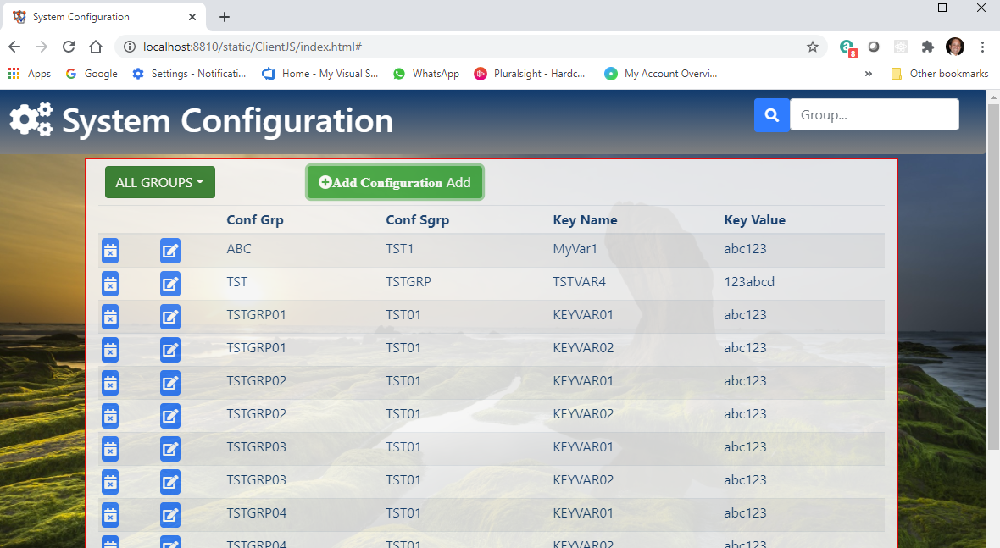

# PASOE Rest WebService

PASOE REST Webservice example exposing Progress DB data to JavaScript and .NET Clients

_by Armando Pensado_

## Description

Consider this, your company has an application made using Progress OpenEdge, possibly the application is a character base. Through many years, the line on business (LOB) has been adding important logic to the system in an effort to stay ahead of the competition. 

Now, the company realize that the system needs modernization, providing access for modern devices (e.g. tables, cell phones, computers, etc.). The Company considers to adopt a new system in the market, and after research it comes to the conclusion that there is no software that gets close to their existing functionality. They realize that the internal system is heavily customized, and adoption a new system means losing the competitive advantage, as the company processes needs to change. Sounds familiar?

The example provided here, presents the idea about implementing the Progress Application Server for OpenEdge (PASOE) as a doorway to modernize an existing system using Progress technology, and offer a gradual path for integrating other technologies that open interconnection with modern devices, and perhaps, a gradual path for a full technology replacement. 

## Who can benefit from this application

This project is oriented to help Progress OpenEdge, Java Script , and .NET developers, which are facing a constant pressure for modernizing existing applications made base on Progress Technologies. 

This project provides an opinion about finding a solution by adopting PASOE to implement a REST Webservice, ideas about the ABL programing required, and  how Java Script and .NET clients can interact with the Webservice. 

## How developers can get started

