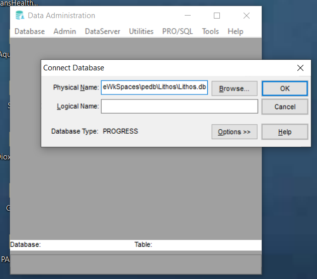
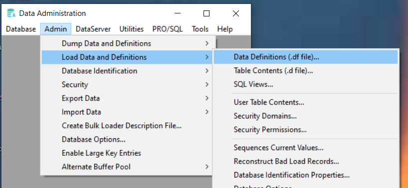
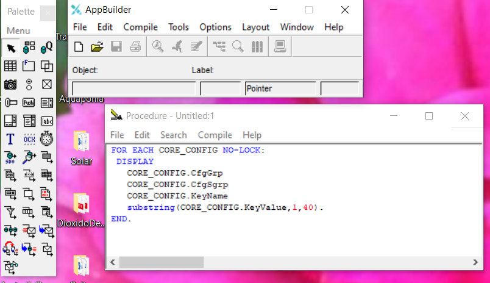
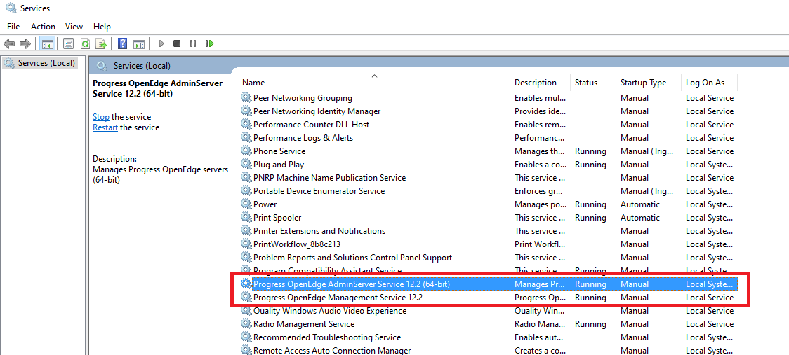
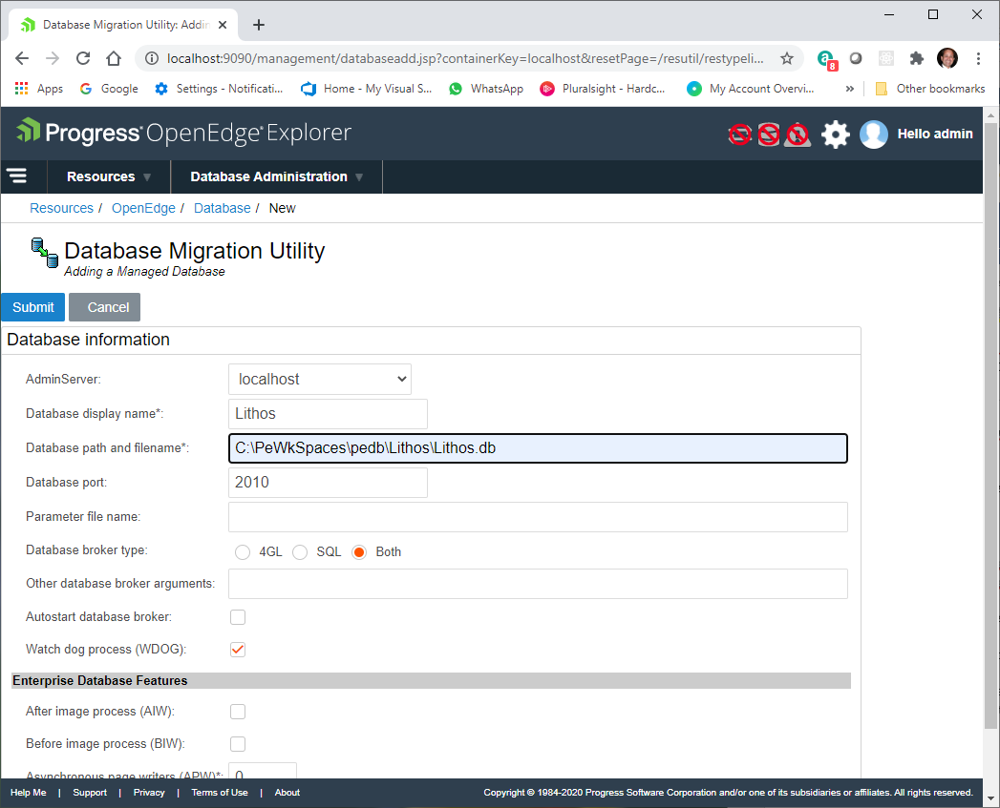

# PASOE Rest WebService - Create and Configure a Progress OE database

This section takes the reader to the steps to create and configure a new database to run as multi-user in a local compuer, required to execute the project. 

_by Armando Pensado_

## Steps to create a local database

**Step 1** - Define a folder where the database will exist in the local computer. 

**Step 2** – Copy an existing ST file or create one inside the folder for the database. For this project one is provided under \DatabaseDefs\Lithos.st

**Step 3** - Open ProEnv and change into the folder defined in step 1.

**Step 4** – Invoke the command to create a raw database as follows:

```js
    Example:  %DLC%\bin\prostrct create Lithos Lithos.st

    Note: 
         if the environment variable is not defined 
         use full path for PProgress OpenEdge binaries, 
         for example:
         
    Example: C:\Progress\OpenEdge\bin\prostrct create MyDB MyDb.st
```

**Step 5** – Finalize the database by using copying comand from a base database inlcuded with Progress OpenEdge. The command is as follows: 

```js
  Example: %DLC%/bin/procopy %DLC%/empty Lithos
```

**Step 6** – Using the _Database Administration_ Tool connect to the database to verify the database was created properly. Provide the full path to the physical location. For example, 

```js
   C:\PeWkSpaces\pedb\Lithos\Lithos.db
```





**Step 7** - Load schema definitions by coping the provided DF file into the folder where the database is located, **DatabaseDefs\Lithos.df**, and using the _Database Administration_ Tool, go to **admin menu -> Load data and definitions -> Data Definitions (.df file)**, and load the file. The schema load can be verified under **Database -> Reports**. A single table will be loaded  : **CORE_CONFIG**.




**Step 9** – Load example data by copying the provided D file into the folder where the DB resides, **DatabaseDefs\CoreConfig.d**, and using the _Database Administration_ Tool, go to  **admin menu -> Load data and definitions -> Table Contents (.d file)**, and load it. The data load can be verified by closing the Database Administration Tool, and opening the _AppBuilder_. Connect to the database using the full path. **Using Tools -> New Procedure Window**, se the following code to visualize the data in the **C**ORE_CONFIG** table,

```js
FOR EACH CORE_CONFIG NO-LOCK:
 DISPLAY 
   CORE_CONFIG.CfgGrp 
   CORE_CONFIG.CfgSgrp 
   CORE_CONFIG.KeyName 
   substring(CORE_CONFIG.KeyValue,1,40).
END.
```




**Step 10** – Close the AppBuilder and proceed to create a connection into the OE Explorer.


## Connecting the Database into OE Explorer

**Step 1** - Inspect at the Windows services that the Progress OpenEdge services are running.

* Progress OpenEdge AdminServer Service 12.2 (64-bit)
* Progress OpenEdge Management Service 12.2



**Step 2** – Open OE Explorer. For a brand new installation the initial login and password will be the word “**admin**”. For a this exercise in a local computer the password can remain as it is or if preferred, change the password. The OE Explorer will show some resources already created. But will ne no database.

**Step 3** – Add the a database by selecting from the menu **Resources -> Database**. A dialog will request the fundamental parameters for a database. For the purpose of this exercise, provide the _database name_, _database full path_ and a _Database TCP/IP port_.  The broker type should remain as *Both*.



**Step 4** – At this point the database can be started, and it will become a multi-user database. In other words, several clients can connect at the same time to the database.


## Comments and considerations

For the purpose of this exercise, Progres OpenEdge Studio comes with a max of five available connections, which are normally enough for the developer’s work. In general, Progres OpenEdge Studio will use two connections out of the five, one for retrieving meta-schema information (SQL connection) and a connection for code deployment (4GL connection).

If a deeper experimentation is needed, the reader is welcome to install and use a real server that can accommodate more connections.
