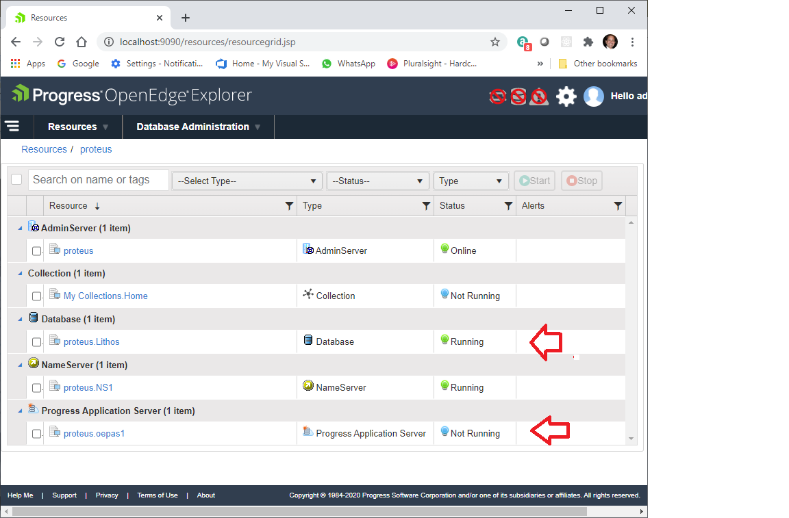

# PASOE Rest WebService - Configure PASOE in OE Explorer

This section takes the reader into the steps to configure the PASOE instance that comes integrated with the OE Explorer that will be essential to expose the REST Webservice. 

*Important*: For the exercise, a local database is required for this step. However, It can also be an existing database in your environment in your local network.
 


## Steps to configure PASOE (oepas1)

**Step 1** - Open the OpenEdge Explorer and in the resources listing, locate the Database created in previous section and also locate the “oepas1” instance under “Progress Application Server” section.




**Step 2** – Open oepas1 and configure, click on top of the resource and that will present the configuration page for the resource. To the left there are main configuration elements for the overall operation. For this exercise, these can be left with the default values. Instead select again the “oepas1” instance listed in this page under the Applications tab.


**Step 3** – at this page select the configuration link, that is found on top of the ROOT  ABL Webapps section.


**Step 4** – In this page, there are some settings by default, but the reader most focus in three distinct elements: **Agent Working Directory**, **Agent Startup parameter**, and **PROPATH**. Each of these elements will play a vital role for connecting to the database, and finding the proper API that will be develop and deployed. 


For this exercise, the example configuration is indicated below. The reader must out attention to the database connection, and the PROPATH. The **Agent Working Directory** and **PROPATH** come pre-configured. However, a close inspection will reveal the location in which the oepas1 instance is included with the development tool.   

```js
    Agent working directory: 
       ${CATALINA_BASE}/work

    Agent startup parameter: 
       -T "${catalina.base}/temp" -db Lithos.db -H Localhost -S 2010 -L 10000 -B 10000 -n 800 -aibufs 40

    PROPATH : 
      ${CATALINA_BASE}/webapps/ROOT/WEB-INF/openedge,
      ${CATALINA_BASE}/ablapps/oepas1/openedge,
      ${CATALINA_BASE}/openedge,${DLC}/tty,
      ${DLC}/tty/netlib/OpenEdge.Net.pl
```
The reader can get familiar with other sections. Once the REST webservice is deployed and running, it is recommended to return to this sections in the OE Explorer to gain more understanding with the way is working. 

**Step 5** – Once the configuration is in place the reader can start the oepas1 instance and observe the additional elements that become visible under the ROOT link.


## Where can the oepas1 instance be found?

A regular OpenEdge Studio installation will create a work folder (e.g. C:\OpenEdge\WRK). It is inside this folder that the oepas1 instance reside. Under this folder there are key folders that is important to get familiarized. 


* **Logs folder** – This folder will contain all logs related to the activity once ethe oepas1 instance is executing. Because the PASOE is using Tom Cat server, there will configuration variables with the word “CATALINA”. 

* **oepas1/webapp folder** – This folder will contain the web applications running for this oepas1 instance.

* **oepas1/webapp/ROOT** – this is the main web application

* **oepas1/webapp/ROOT/static** – this is place where a frontend application cam reside.

* **oepas1/webapps/ROOT/WEB-INF folder** – this folder contains the definitions of deployed services.

* **oepas1/webapps/ROOT/WEB-INF/adapters/rest** – this folder contain the defintions for RETS application deployed.


